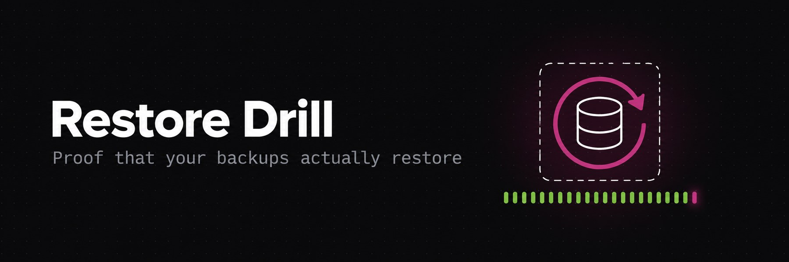
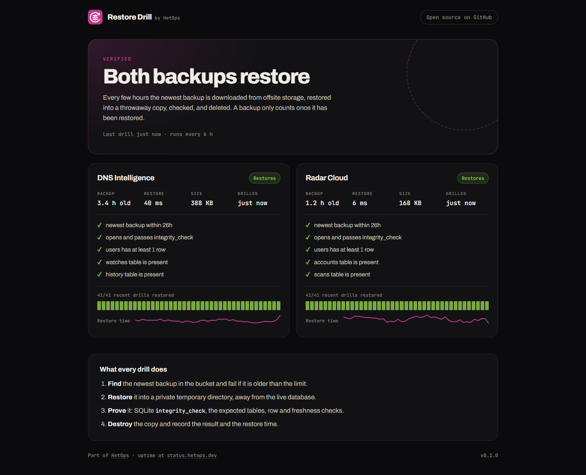
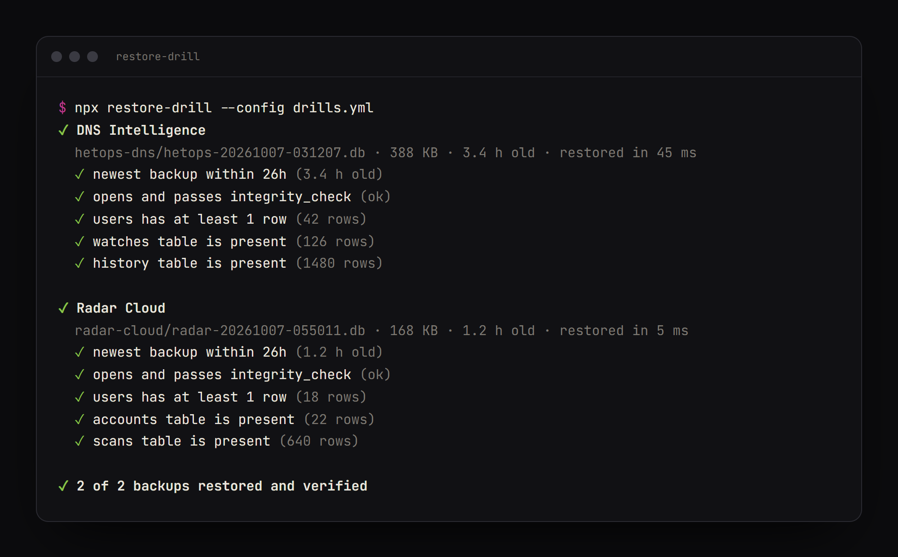

<p align="center">
  
</p>

<h1 align="center">Restore Drill</h1>

<p align="center">
  <b>Scheduled proof that your backups actually restore.</b><br />
  Pulls the newest SQLite or PostgreSQL backup from S3-compatible storage, restores it into a throwaway copy, checks it, and throws it away.
</p>

<p align="center">
  <a href="https://github.com/Het101/restore-drill/actions/workflows/ci.yml"></a>
  <a href="LICENSE"></a>
  <a href="https://drill.hetops.dev"></a>
</p>

---

A backup that has never been restored is a hope, not a backup. Most teams find out their backups are empty, corrupt or weeks old on the day they need them. Restore Drill finds out every few hours instead.

<p align="center">
  
</p>

## What every drill does

1. **Find** the newest backup under a prefix in your bucket, and fail if it is older than the limit (a backup job that silently stopped is the most common failure).
2. **Restore** it somewhere disposable, never near the live database: a private temporary directory for SQLite, a throwaway PostgreSQL server started inside the container for Postgres dumps.
3. **Prove** it: SQLite `integrity_check` or a clean `pg_restore`, the tables you expect, minimum row counts, how fresh the newest row is, or any query you write.
4. **Destroy** the copy, and record the result and how long the restore took.

Data never leaves your infrastructure: the agent runs next to your storage and only reads from it.

## Run it once

```bash
git clone https://github.com/Het101/restore-drill && cd restore-drill
npm ci
cp .env.example .env   # storage endpoint and a read-only key
node --env-file=.env cli.js --config drills.yml
```

<p align="center">
  
</p>

It exits `1` when any drill fails, so it also works from cron or a CI job. `--json` prints the full results.

## Configure the drills

`drills.yml` says where the backups live and what a good restore looks like. `${VAR}` comes from the environment, `${VAR:-default}` has a fallback, so keys never sit in the file.

```yaml
storage:
  endpoint: ${S3_ENDPOINT} # R2, S3, B2, MinIO: anything S3-compatible
  bucket: ${S3_BUCKET:-backups}
  access_key_id: ${S3_ACCESS_KEY_ID} # read-only is enough
  secret_access_key: ${S3_SECRET_ACCESS_KEY}

every: 6h # how often the agent drills

drills:
  - name: Billing database
    prefix: billing/ # newest object under this prefix is restored
    match: '\.db(\.gz)?$' # optional: ignore other files
    max_age: 26h # nightly backups; older means the job stopped
    checks:
      - table: invoices
        min_rows: 1000
      - table: invoices
        newest: created_at # seconds, milliseconds or ISO dates
        max_age: 2d
      - query: SELECT COUNT(*) FROM users WHERE email IS NULL
        expect: 0

  - name: Analytics
    engine: postgres # pg_dump custom format (.dump/.dmp) or plain SQL, optionally .gz
    prefix: postgres/analytics/
    checks:
      - table: website_event # schema.table works too
        newest: created_at
        max_age: 2d
```

| Check | Passes when |
| --- | --- |
| *(always)* `newest backup within max_age` | the newest backup is recent enough |
| *(always, SQLite)* `opens and passes integrity_check` | the file is a SQLite database and `PRAGMA integrity_check` says `ok` |
| *(always, Postgres)* `restores cleanly into a fresh PostgreSQL` | `pg_restore --exit-on-error` (or `psql -v ON_ERROR_STOP=1` for plain SQL) finishes without an error |
| `table` + `min_rows` | the table exists with at least that many rows (`min_rows: 0` = it exists) |
| `table` + `newest` + `max_age` | the newest value in that column is recent enough |
| `query` + `expect` | the first column of the first row equals `expect` |

Gzipped backups (`.gz`) are decompressed before the restore.

**How the Postgres restore works.** The agent runs `initdb` in a private temporary directory and starts a PostgreSQL 17 server that listens on a Unix socket only (no TCP port), restores the dump with ownership and grants stripped (the source server's roles don't exist here), runs the checks through `psql`, then stops the server and deletes the directory. It needs no Docker socket and never connects to your live database. PostgreSQL 17 restores dumps from older servers too.

## Run it as a service

The agent runs every drill on the `every` interval and serves:

| Endpoint | What |
| --- | --- |
| `GET /` | the evidence page above, refreshed every minute |
| `GET /api/health` | `{"ok": true, "drills": [...]}`: point a monitor at `ok` |
| `GET /api/history` | recent runs per drill, kept for 30 days |

```bash
docker build -t restore-drill .
docker run -d -p 3000:3000 --env-file .env -v drill-data:/app/data restore-drill
```

The image runs as a non-root user, ships no compiler, and keeps its history in `/app/data`. Mount your own config with `-v ./drills.yml:/app/drills.yml`.

**Alerting.** Point any uptime monitor at `/api/health`. In Uptime Kuma: monitor type *HTTP(s) - Json Query*, JSON query `ok`, expected value `true`. The drill then pages you the same way as everything else.

**What is public.** The page and `/api/health` show pass/fail, check names, restore times and backup age. Row counts, query results and storage URLs stay in the agent's logs.

## Storage keys

Give the agent a key that can only read the backup bucket. On Cloudflare R2: *R2 → Manage API tokens → Create token*, permission **Object Read only**, scoped to the one bucket, and optionally limited to your server's IP.

## Dogfooded on HetOps

[drill.hetops.dev](https://drill.hetops.dev) drills the nightly backups of [DNS Intelligence](https://dns.hetops.dev) and [Radar Cloud](https://radar.hetops.dev) from Cloudflare R2 with the `drills.yml` in this repo, and [status.hetops.dev](https://status.hetops.dev) alerts if a drill fails.

## Roadmap

- ~~PostgreSQL~~: shipped in 0.2.0
- MySQL / MariaDB
- Email and webhook alerts without a separate monitor
- A monthly evidence report (PDF) for SOC 2 and ISO 27001 audits: every drill, its result and restore time

## Development

```bash
npm ci
npm test      # fake S3 bucket, real SQLite files and real pg_dump output: good, corrupt, stale, incomplete
              # (Postgres tests need initdb/pg_restore on PATH and Linux or macOS; they skip elsewhere)
npm run lint
npm run hooks # conventional, signed commits
```

Request signing is hand-rolled Signature V4 (no AWS SDK) and is tested against AWS's published example signatures.

## License

[MIT](LICENSE) © Het Patel · part of [HetOps](https://hetops.dev)
